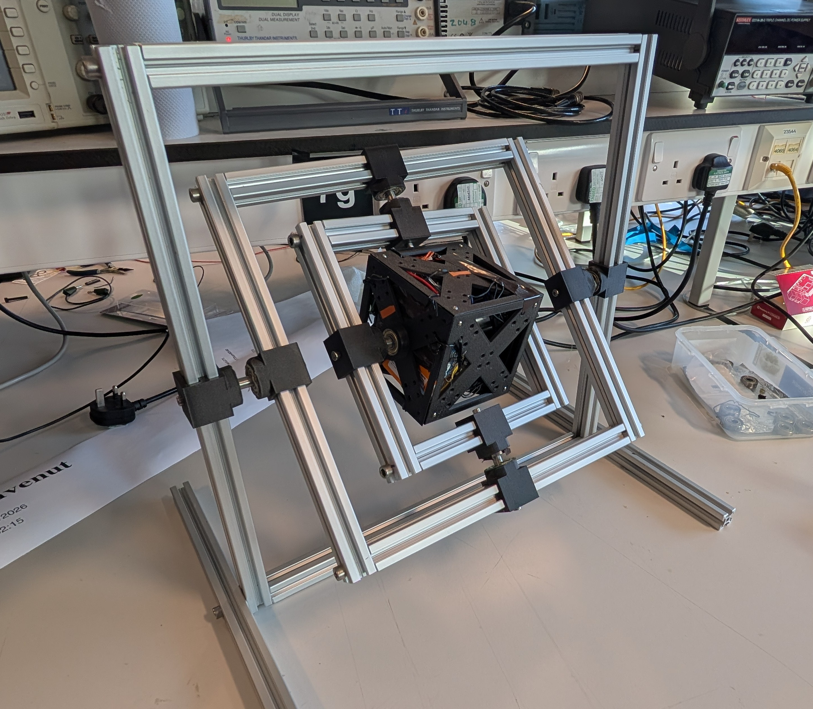
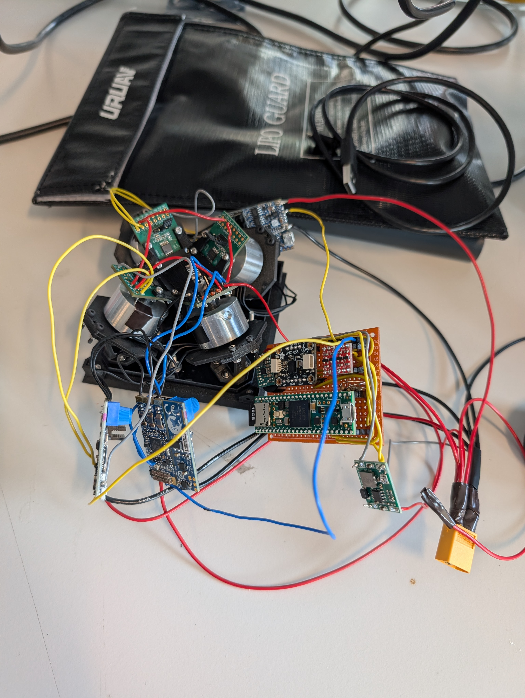
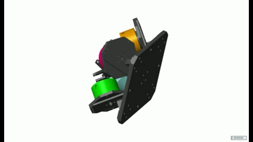

# CubeSat-Fault-Tolerant-Control

This is a repository for my final year project focused on the design of a fault-tolerant attitude control system for CubeSats. Specifically, it aims to deliver an over-actuated reaction wheel system, allowing for fault-tolerant control of a small CubeSat. It will achieve this through the use of reaction wheels. These are motor driven flywheels that generate angular momentum in order to rotate an object through conservation of momentum. The project should be able to demonstrate attitude control along a commanded axis in the event of failure in one reaction wheel or degradation of performance.

  

